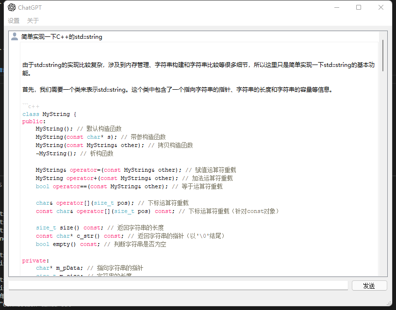

## ChatGPT
ChatGPT with gpt-3.5-turbo developed by Qt


## Build & Run
```
    # install qt and set qt to path(安装qt,vs,并配置环境目录)
    cmake -Bbuild_vs .
    cmake --build build_vs --config Release
    build_vs\Release\chatgpt.exe
```

## Screencasts
